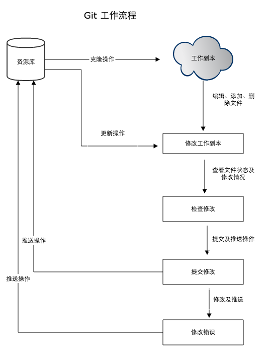
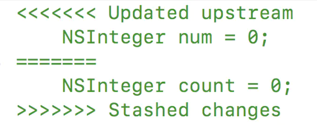

title: Git
author: Bing
tags:
  - git
categories: []
date: 2021-04-23 21:40:00

---

## Git

##### Git工作流程

##### git pull冲突解决

1.存储本地修改的内容

git stash 找到刚才打的stash的名字(默认是stash@{0}),不知道名字运行git stash list

2.pull拉取远程代码

3.还原暂存的代码

git stash pop stash@{0}

4.有merge解决merge：
打开冲突文件

其中Updated upstream和=======之间的内容是从远端pull下来的代码。

=======和Stashed changes之间的内容则是你本地修改的内容。

git push发生冲突时，其他人提交了代码，本地库不是最新。需要git pull走一遍，有merge解决merge再提交。

git push --force，远程上的代码库将被本地更新后的版本覆盖！

##### Reference：

https://www.runoob.com/git/git-workspace-index-repo.html