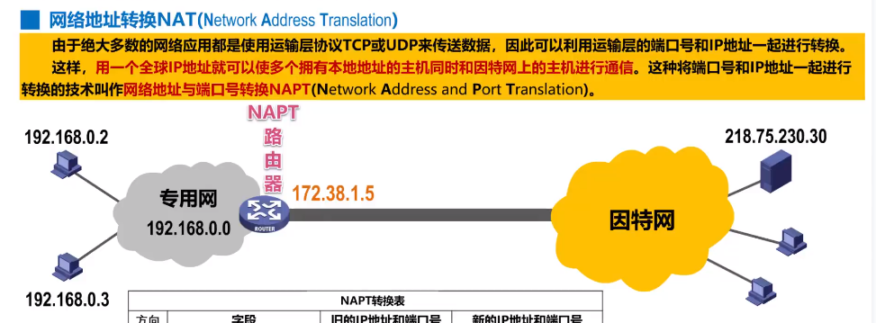
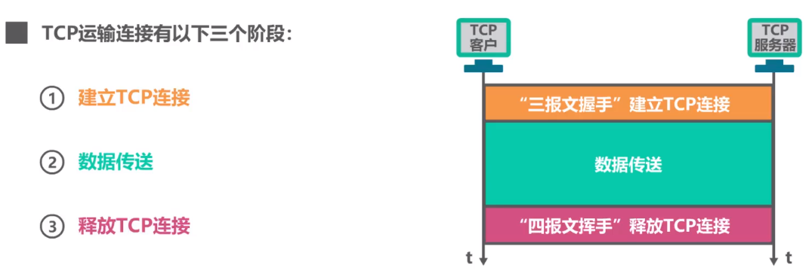
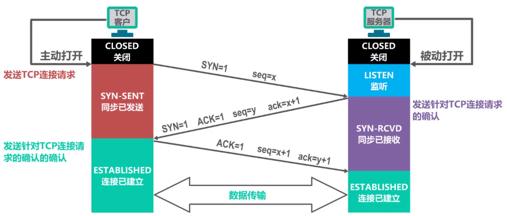
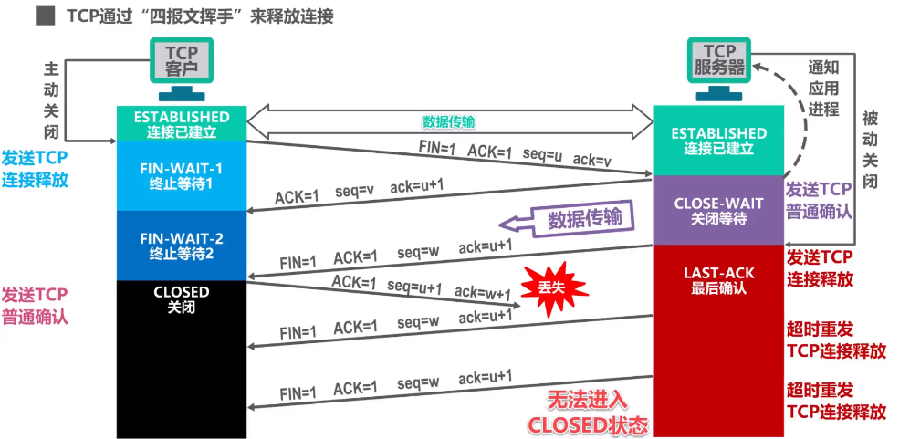
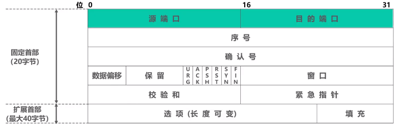
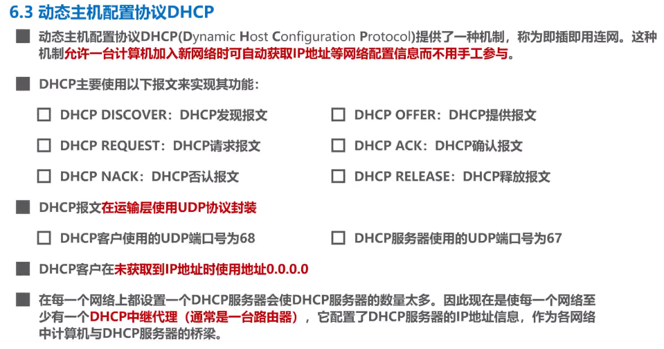

title: 从零开始的计算机网络
author: Bing
tags:

  - 计算鸡网络
categories: []
date: 2021-03-07 14:07:00

---
##### 3.7 
MAC地址 
又称硬件地址，物理地址，但不属于物理层，属于数据链路层。 
例：XX-XX-XX-XX-XX-XX  

##### 3.7  
IP地址 
是因特网上主机与路由器使用的地址，用于标识：1 网络编号 2 同一网络上的不同主机。 
数据包转发过程种IP地址与MAC地址的变化：1 源IP地址和目的IP地址不变；2 源MAC地址和目的MAC地址逐个链路改变。  

##### 3.8
地址解析协议ARP  

##### 3.10
生成树协议STP 
在增加冗余链路提高网络可靠性的同时避免网络环路带来的问题。 
不论交换机之间采用怎样的物理连接，交换机都能自动计算并构建一个逻辑上没有环路的网络。其逻辑拓扑结构必须是树形的。  

##### 4.4 IP数据报的发送和转发过程

源主机如何知道目的主机是否与自己在同一个网络中？

比较网络地址

##### 4.5 静态路由配置及其可能产生的路由环路问题 （pass）

##### 4.6.1 路由选择协议概述（pass）

静态路由选择

动态路由选择

因特网采用分层次的路由选择协议

##### 4.6.2 路由信息协议RIP的基本工作原理（pass）

RIP认为好的路由就是距离短的路由，也就是所通过路由器最少的路由。

##### 4.6.3 开发最短路径优先OSPF的基本工作原理（pass）

##### 4.6.4 边界网关协议BGP的基本工作原理（pass）

#####  4.7 IPv4数据报的首部格式

首部检验和：

IP层本身不提供可靠传送服务。IPv6中不再计算首部校验和。

##### 4.8 网际控制报文协议ICMP

- 为了更有效转发IP数据报和提高交付的机会。
- 主机或路由器使用ICMP来发送差错报告报文和询问报文。
- ICMP报文被封装在IP数据报中发送。

##### 4.9 虚拟专用网VPN与网络地址NAT

**Virtual Private Network**

**网络地址转换NAT Network Address Translation**

为了减缓IPv4地址空间耗尽的速度，1994年提出了一种网络地址转换NAT的方法再次缓解了IPv4地址空间即将耗尽的问题。

**NAT**能使大量使用内部专用地址的专用网络用户共享**少量外部全球地址**来访问因特网上的主机和资源。

**NAPT**

##### 5.1 运输层概述

物理层、数据链路层和网络层共同解决了将主机通过异构网络互联起来的问题。

实际上在计网中通信的真正实体使位于通信两端主机中的进程。

运输层协议又称端到端协议。

##### 5.2 运输层端口号、复用与分用

进程标识符PID，不同OS不同。

在浏览器中输入网站enter后发生了什么？

##### 5.3 UDP/TCP

##### 5.4 TCP的流量控制

- 发送方的发送速率不要太快，要让接收方来得及接收。
- 利用**滑动窗口**机制可以方便的在TCP连结上实现对发送方的流量控制。

##### 5.5 TCP的拥塞控制

**TCP拥塞控制算法**

- 慢开始 slow start
- 拥塞避免 congestion avoidance
- 快重传 fast retransmit
- 快恢复 fast recovery

##### 5.6 TCP超时重传时间的选择 （pass）

##### 5.7 TCP可靠传输的实现

TCP基于以字节为单位的滑动窗口来实现可靠传输。

##### 5.8 TCP运输连接管理—TCP连接建立

解决问题：

- TCP双方能确知对方的存在
- 能够协调一些参数
- 能对运输实体资源进行分配

采用三报文握手而不是两报文握手来建立TCP连接，是为了防止已失效的连接请求报文段突然又传送到了TCP服务器进程导致的错误。

##### 5.9 TCP的运输连接管理——TCP的连接释放

时间等待状态是否有必要？

TCP服务器进程会反复重传TCP连接释放报文，并一直处于确认状态不会关闭。

2倍MSL是时间可以使本次连接持续时间内所产生的所有报文段都从网络中消失。下一个新连接中不会出现旧报文。

##### 5.9 TCP报文段的首部格式

6.1 应用层概述

##### 6.2 客户/服务器方式（C/S）和对等方式（P2P）

**C/S（Client/Server）**

- 客户和服务器是两个应用进程
- 方式描述的是服务和被服务的关系
- 客户是服务请求方，服务器是服务提供方
- 服务器总是运行状态，等待客户的服务请求。服务器具有固定的端口号（HTTP服务的默认端口号是80），运行服务器的主机也具有固定的IP地址。

例：www万维网、电子邮件

基于C/S的应用服务通常是**服务集中型**，应用服务集中在网络中比客户计算机少得多的服务计算机上。

##### P2P（Peer to Peer）

P2P方式中，没有固定的服务请求者和服务提供者。各应用进程是对等的，称为对等方。对等方相互之间直接通信，每个对等方既是服务的请求者，又是服务的提供者。

例：P2P文件共享、即时通讯、P2P流媒体、分布式存储等。

基于P2P的应用是**服务分散型**的，服务不是集中在少数几个服务器计算机中，而是分散在大量对等计算机中，这些计算机不为服务提供商所有。

##### 6.3 动态主机配置协议（PHCP）

##### 6.4 域名系统DNS（Domain Name System）

当在浏览器输入域名时，用户主机会首先在自己的DNS高速缓存中查找该域名所对应的IP地址，找不到再询问DNS服务器。

（我TM直接泪目。。。）

##### 6.5 文件传送协议FTP

 FTP客户和服务器之间要建立两个并行的连接：

一个是控制连接，在整个会话期间一直保持打开，用于传输FTP相关控制命令。

另一个是数据连接，用于文件传输，在每次文件传输时才建立，传输结束就关闭。

默认FTP使用TCP 21端口进行控制连接，TCP 20端口进行数据连接。

##### 6.6 电子邮件（pass）

##### 6.7 万维网WWW

- HTTP1.0采用非持续连接方式
- HTTP1.1采用持续连接方式

**使用cookie在服务器上记录用户信息：**

- 早期万维网应用比较简单，仅仅是用户查看在不同服务器上的静态文档。因此HTTP被设计成一种无状态的协议，简化服务器设计。
- 现在用户可以通过万维网实现各自复杂的应用，如网上购物、电子商务等，需要万维网能够识别用户。

