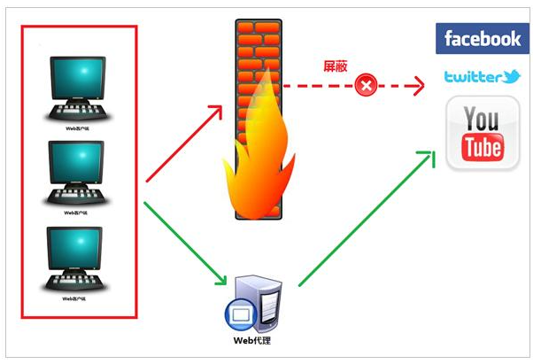

title: 从零开始的计网知识总结
author: Bing
tags:
  - 计算鸡网络
categories: []
date: 2021-04-29 21:57:00
---
##### IP地址会重复吗？

这是属于IP协议规定的私有地址，也就是说，在具体的支持IP协议的网络的部署时候就已经约定好了，目标地址为一下三个网段的IP报文将不会被中间节点进行转发，这些报文将不会出现在公网中。
10.0.0.0 - 10.255.255.255 
172.16.0.0 - 172.31.255.255  
192.168.0.0 - 192.168.255.255 
也正是有这些私有IP的存在，局域网内用户可以通过NAT等技术使用有限几个公网IP上网，这也使得原本早就应该耗尽的IPv4地址空间拖延到现在也没出现太大的问题，这也就一定程度上延缓了IPv6的部署。

[Private network](https://link.zhihu.com/?target=http%3A//en.wikipedia.org/wiki/Private_IP_address)（连VPN再上）

> In the [Internet](https://link.zhihu.com/?target=http%3A//en.wikipedia.org/wiki/Internet) addressing architecture, a **private network** is a [network](https://link.zhihu.com/?target=http%3A//en.wikipedia.org/wiki/Computer_network) that uses private [IP address](https://link.zhihu.com/?target=http%3A//en.wikipedia.org/wiki/IP_address) space, following the standards set by [RFC 1918](https://link.zhihu.com/?target=http%3A//tools.ietf.org/html/rfc1918) for IPv4 and [RFC 4193](https://link.zhihu.com/?target=http%3A//tools.ietf.org/html/rfc4193) for IPv6. These addresses are commonly used for home, office, and enterprise [local area networks](https://link.zhihu.com/?target=http%3A//en.wikipedia.org/wiki/Local_area_network) (LANs), when globally routable addresses are not mandatory, or are not available for the intended network applications. Under [Internet Protocol](https://link.zhihu.com/?target=http%3A//en.wikipedia.org/wiki/Internet_Protocol)[IPv4](https://link.zhihu.com/?target=http%3A//en.wikipedia.org/wiki/IPv4), private IP address spaces were originally defined in an effort to delay [IPv4 address exhaustion](https://link.zhihu.com/?target=http%3A//en.wikipedia.org/wiki/IPv4_address_exhaustion), but they are also a feature of the next generation Internet Protocol, [IPv6](https://link.zhihu.com/?target=http%3A//en.wikipedia.org/wiki/IPv6).
> These addresses are characterized as private because they are not  globally delegated, meaning they are not allocated to any specific  organization, and IP packets addressed by them cannot be transmitted  onto the public Internet. Anyone may use these addresses without  approval from a [regional Internet registry](https://link.zhihu.com/?target=http%3A//en.wikipedia.org/wiki/Regional_Internet_registry) (RIR). If such a private network needs to connect to the Internet, it must use either a [network address translator](https://link.zhihu.com/?target=http%3A//en.wikipedia.org/wiki/Network_address_translator) (NAT) gateway, or a [proxy server](https://link.zhihu.com/?target=http%3A//en.wikipedia.org/wiki/Proxy_server).

##### 代理服务器（Proxy Server）

企业可以通过代理服务器使员工只能会见公司内部的几个网站。

代理服务器有很多种，http、ftp、socks，又分透明代理和不透明代理。

reference：

https://www.wse.me/keji/vpn-shi-shen-me-xu-ni-wang-luo-vpn-wu-xian-zhi-fang-wen-wai-wang-131408.htm

https://www.cnblogs.com/tianyiliang/p/8213933.html