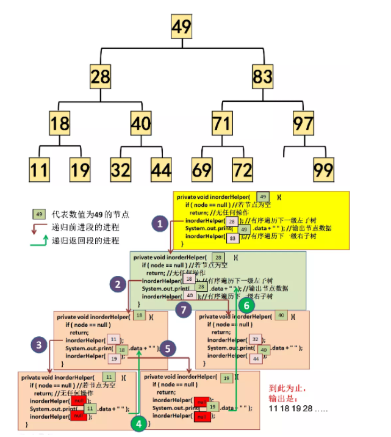
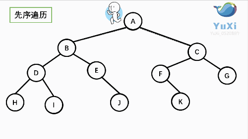

title: 数据结构与算法
author: Bing
tags:

  - C++
categories:
  - C++
date: 2021-04-10 22:12:00

---

### 二叉树

从二叉树看递归


- 递归条件
- 终止条件

例：二叉树深度（Leetcode.104）

终止条件：树为空时，深度为0

每一级的返回值是当前级对应的树的最大深度。


```c++
int Height(TreeNode* root)
{
	if(root == nullptr)
	{
		return 0;
	}
	int leftHeight = Height(root->left);
	int rightHeight = Height(root->right);
	return max(leftHeight, rightHeight) + 1;
}
```



迭代法的三种遍历



```c++
// 前序遍历
vector<int> preorderTraversal(TreeNode* root) 
{
    vector<int> res;
    if (root == nullptr) 
        return res;

    stack<TreeNode*> stk;
    while (root != nullptr || !stk.empty()) 
    {
        while (root != nullptr)  // 遍历左子树
        {
            res.emplace_back(root->val); // 遍历的同时放入结果
            stk.emplace(root);
            root = root->left;
        }
        root = stk.top(); // 左子树为空，向上出栈
        stk.pop();
        root = root->right;
    }
    return res;
}
```

```c++
// 中序遍历
vector<int> inorderTraversal(TreeNode* root)
{
    vector<int> res;
    if (root == nullptr) 
        return res;

    stack<TreeNode*> stk;
    while(root != nullptr || !stk.empty()) 
    {
        while(root != nullptr) // 遍历左子树
        {
            stk.push(root);
            root = root->left;
        }
        root = stk.top(); // 左子树为空，出栈
        stk.pop();	
        res.push_back(root->val);  // 放入结果
        root = root->right; // 向上走有右子树
    }
    return res;
}
```

```c++
class Solution {
public:
    vector<int> postorderTraversal(TreeNode *root) {
        vector<int> res;
        if (root == nullptr) {
            return res;
        }

        stack<TreeNode *> stk;
        TreeNode *prev = nullptr;
        while (root != nullptr || !stk.empty()) 
        {
            while (root != nullptr) // 遍历左子树
            {
                stk.emplace(root);
                root = root->left;
            }
            root = stk.top(); // 左子树为空，往上出栈
            stk.pop();
            if (root->right == nullptr || root->right == prev) // 出栈的root没有右子树
            {
                res.emplace_back(root->val);
                prev = root;
                root = nullptr;
            } 
            else // 出栈的root有右子树，继续压栈，搜索右子树的左子树
            {
                stk.emplace(root);
                root = root->right;
            }
        }
        return res;
    }
};
链接：https://leetcode-cn.com/problems/binary-tree-postorder-traversal/solution/er-cha-shu-de-hou-xu-bian-li-by-leetcode-solution/
```


### 优先队列

二叉堆的两个性质：

1.结构性

堆实际上是一棵完全二叉树，底层元素从左到右填入，所以堆的高度为**logN**，因为完全二叉树的规律性，堆其实可以看作是一个数组，在这个数组中，**父节点位于 i /2 位置**，则**左子节点则在 2i位置**，**右子节点在 2i + 1**上
2.堆序性

让堆操作快速执行的性质是堆序性，最小元位于根上，在一个堆中，对于每一个节点X，X的父亲小于或者等于X，根节点除外。

**上滤**

```c++
void insert(AnyType x) 
{
    //判断当前堆（数组）是否已满，满则扩容，防止数组越界
    if(currentSize == array.length -1)
        enlargeArray(array.length * 2 + 1);

    //将要插入的元素放在最后一个叶子节点，即数组最后一个元素的位置
    int hole = ++currentSize;

    //父节点 ：hole / 2 
    //左子节点：2*hole
    //右子节点：2*hole+1
    //x和父节点比较，比父节点大则上滤，原父节点下滤
    for(array[0] = x ;x.compareTo(array[hole/2]) < 0 ; hole/=2) 	{
        array[hole] = array[hole / 2];
    }
    //最后再将要插入的值赋值过去符合的节点处
    array[hole] = x;
}
```

