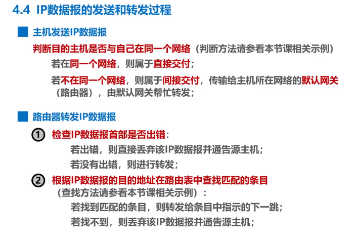
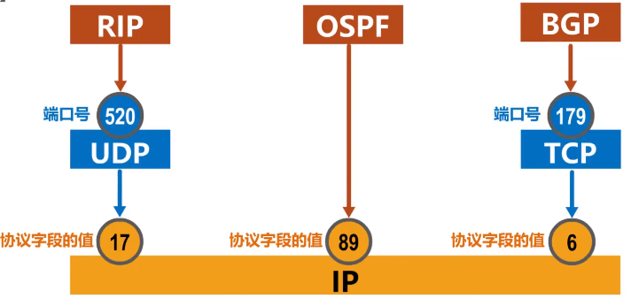
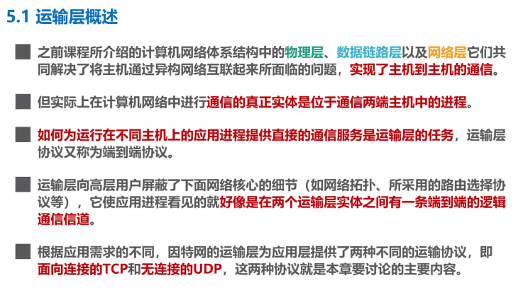
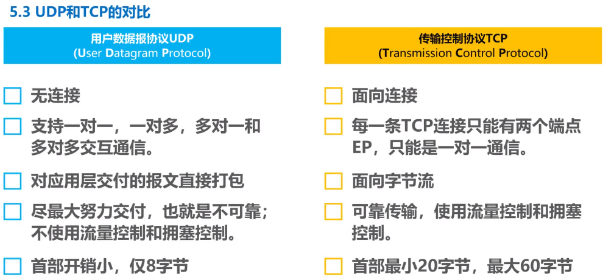

title: 计算机网络
author: Bing
tags:
  - 计算机网络
categories: []
date: 2021-03-07 14:07:00
---
##### 3.7 
MAC地址  
又称硬件地址，物理地址，但不属于物理层，属于数据链路层。  
例：XX-XX-XX-XX-XX-XX  

##### 3.7  
IP地址  
是因特网上主机与路由器使用的地址，用于标识：1 网络编号 2 同一网络上的不同主机。  
数据包转发过程种IP地址与MAC地址的变化：1 源IP地址和目的IP地址不变；2 源MAC地址和目的MAC地址逐个链路改变。  

##### 3.8
地址解析协议ARP  

##### 3.10
生成树协议STP  
在增加冗余链路提高网络可靠性的同时避免网络环路带来的问题。  
不论交换机之间采用怎样的物理连接，交换机都能自动计算并构建一个逻辑上没有环路的网络。其逻辑拓扑结构必须是树形的。  

##### 4.4 IP数据报的发送和转发过程

源主机如何知道目的主机是否与自己在同一个网络中？

比较网络地址

##### 4.5 静态路由配置及其可能产生的路由环路问题 （pass）

##### 4.6.1 路由选择协议概述（pass）

静态路由选择

动态路由选择

因特网采用分层次的路由选择协议

##### 4.6.2 路由信息协议RIP的基本工作原理（pass）

RIP认为好的路由就是距离短的路由，也就是所通过路由器最少的路由。

##### 4.6.3 开发最短路径优先OSPF的基本工作原理（pass）

##### 4.6.4 边界网关协议BGP的基本工作原理（pass）

#####  4.7 IPv4数据报的首部格式

首部检验和：

IP层本身不提供可靠传送服务。IPv6中不再计算首部校验和。

##### 4.8 网际控制报文协议ICMP

- 为了更有效转发IP数据报和提高交付的机会。
- 主机或路由器使用ICMP来发送差错报告报文和询问报文。
- ICMP报文被封装在IP数据报中发送。

##### 4.9 虚拟专用网VPN与网络地址NAT

**Virtual Private Network**

**网络地址转换NAT Network Address Translation**

为了减缓IPv4地址空间耗尽的速度，1994年提出了一种网络地址转换NAT的方法再次缓解了IPv4地址空间即将耗尽的问题。

NAT能使大量使用内部专用地址的专用网络用户共享**少量外部全球地址**来访问因特网上的主机和资源。

NAPT

##### 5.1 运输层概述

物理层、数据链路层和网络层共同解决了将主机通过异构网络互联起来的问题。

实际上在计网 中通信的真正实体使位于通信两端主机中的进程。

运输层协议又称端到端协议。

##### 5.2 运输层端口号、复用与分用

进程标识符PID，不同OS不同。

在浏览器中输入网站enter后发生了什么？

##### 5.3 UDP/TCP

##### 5.4 TCP的流量控制

- 发送方的发送速率不要太快，要让接收方来得及接收。
- 利用**滑动窗口**机制可以方便的在TCP连结上实现对发送方的流量控制。

##### 5.5 TCP的拥塞控制

**TCP拥塞控制算法**

- 慢开始 slow start
- 拥塞避免 congestion avoidance
- 快重传 fast retransmit
- 快恢复 fast recovery

##### 5.6 TCP超时重传时间的选择 （pass）

 

