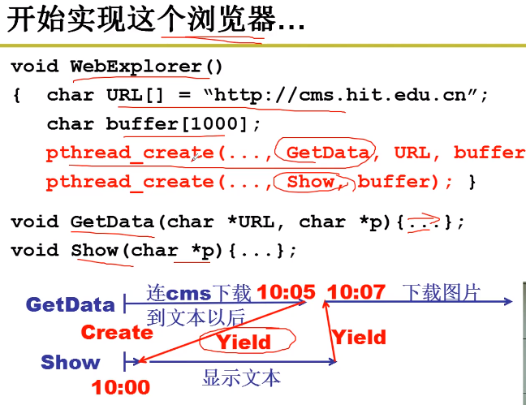
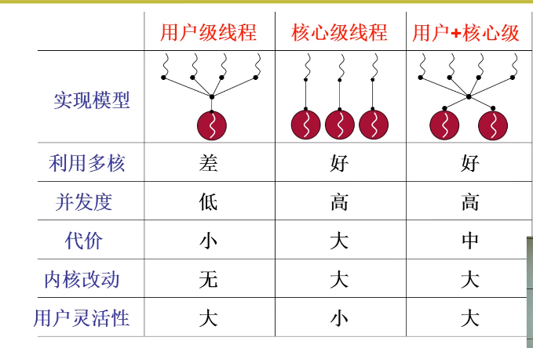

title: 从零开始的操作系统
author: Bing
tags:
  - 操作系统
categories:
  - OS
date: 2021-04-14 15:12:00
---

## 操作系统

管理计算机硬件的软件系统

#### 操作系统接口

操作系统接口。连接操作系统和应用软件，表现为一些函数。

即系统调用，接口表现为函数调用，由系统提供,所以称作系统调用。

POSIX：Portable Operating System Interface Of Unix

#### 系统调用的实现 （System Call！）

**将内核程序和用户程序隔离**

区分内核态和用户态。

当前程序在什么态，由于PC—CS：IP是当前指令，所以用CS最低两位表示：0内核态，3用户态。

初始DPL = 0 、CPL = 3。

硬件提供了主动进入内核的方法，进入内核的唯一方法。int 指令使CS中的CPL更改为0，进入内核。

系统调用的核心：

- 用户程序中包含int指令的代码
- 操作系统写中断处理，获取想调程序的编号
- 操作系统根据编号执行相应的代码

#### 学习任务

掌握CPU管理、内存管理，磁盘管理、终端设备管理。

进程、进程管理、地址（*p = 7）、虚拟内存、文件系统、文件、设备文件、设备驱动

#### CPU管理

工作原理：取址执行

有IO指令和无IO指令计算时间的差别

一个CPU上交替执行多个程序：并发

#### 多进程图像

PCB：Process Control Block 用来记录进程信息的数据结构

进程调度：FIFO、Priority

内存管理的主要内容：多进程的地址空间分离

如何形成多进程图像？

- 读写PCB
- 操作寄存器完成切换
- 调度程序
- 进程的同步与合作
- 有地址映射

#### 用户级线程

线程之间共享资源

Create？Yield？

#### 内核级线程

用户栈 内核栈

#### 内核级线程实现

真让人头大？

