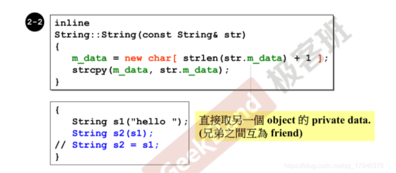
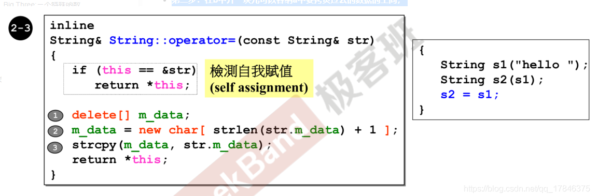

title: 带指针的类和不带指针的类
author: Bing
tags:

  - C++
categories: []
date: 2021-03-21 13:51:00
---
##### 含指针的类要重写拷贝构造和拷贝赋值函数

##### 深拷贝和浅拷贝  

**浅拷贝**
String a("bing");
String b("bing");
a = b;
只是改变了一下指针的指向,对象a和对象b的指针都指向它，通过任意一个指针对其作修改，都会影响另一个的调用。这种状况就叫作浅拷贝。

**深拷贝**  

 
拷贝构造会创建出足够的空间，来放蓝本，比如：”String s2(s1)“意思是说，以s1为蓝本创建出来一个s2;"String s2 = s1;"，创建一个新对象s2,将s1赋值给它，既然s2是新创建出来的，就需要去调用构造函数。 
拷贝赋值 
如果想把a中的值拷贝到b中去，应该分三步：
第一步：把b中的数据清空；
第二步：在b中开一块儿可以容纳a中要拷贝过去的数据的空间；
第三步：将放在a中的数据拷贝到b中去。那么拷贝赋值函数的设计思路也是如此的：  

 
拷贝赋值函数要检测自我赋值。  