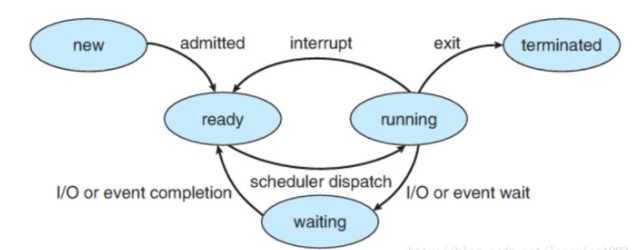

title: 怎么理解阻塞非阻塞与同步异步
author: Bing
tags: []
categories:
  - OS
date: 2021-04-08 13:50:00
---
### A1：

#### **IO密集型和CPU密集型**

IO密集型任务。网络爬虫就是一个非常典型的例子，爬虫在向服务器发起请求之后，有一段时间必须要等待服务器的响应返回，这种任务就属于 IO 密集型任务。对于这种任务，如果我们启用多线程，处理器就可以在某个线程等待的过程中去处理其他的任务，从而提高整体的爬取效率。

CPU 密集型任务。顾名思义，就是任务的运行一直需要处理器的参与。此时如果我们开启了多线程，一个处理器从一个计算密集型任务切换到切换到另一个计算密集型任务上去，处理器依然不会停下来，始终会忙于计算，这样并不会节省总体的时间，因为需要处理的任务的计算总量是不变的。如果线程数目过多，反而还会在线程切换的过程中多耗费一些时间，整体效率会变低。

#### **阻塞和非阻塞**

阻塞和非阻塞关注的是程序在等待调用结果（消息、返回值）时的状态。

阻塞时，在调用结果返回前，当前线程会被挂起，并在得到结果之后返回。

非阻塞时，如果不能立刻得到结果，则该调用者不会阻塞当前线程。因此对应非阻塞的情况，调用者需要定时轮询查看处理状态。

#### 同步和异步

同步和异步关注的是消息通知机制。

同步，是在发出一个调用时，在没有得到结果之前该调用不返回。一旦该调用返回，就表示得到返回值了。

异步，是在调用发出之后，该调用就直接返回了，所以没有返回结果。当一个异步过程调用发出后，调用者不会立刻得到结果，而是在调用发出后，被调用者通过状态、通知来通知调用者，或者通过回调函数处理这个调用。

#### **小结：**

- 在进程通信层面， 阻塞/非阻塞， 同步/异步基本是同义词， 但是需要注意区分讨论的对象是发送方还是接收方。
- 发送方阻塞/非阻塞（同步/异步）和接收方的阻塞/非阻塞（同步/异步） 是互不影响的。
- 在 IO 系统调用层面（ IO system call ）层面， **非阻塞 IO 系统调用** 和 **异步 IO 系统调用**存在着一定的差别， 它们都不会阻塞进程， 但是返回结果的方式和内容有所差别， 但是都属于非阻塞系统调用（ non-blocing system call ）
- 非阻塞系统调用（non-blocking I/O system call 与 asynchronous I/O system call） 的存在可以用来实现线程级别的 I/O 并发， 与通过多进程实现的 I/O 并发相比可以减少内存消耗以及进程切换的开销。

#### 进程间通信的同步/异步，阻塞/非阻塞

- 阻塞式发送（blocking send）. 发送方进程会被一直阻塞， 直到消息被接受方进程收到。
- 非阻塞式发送（nonblocking send）。 发送方进程调用 send() 后， 立即就可以其他操作。
- 阻塞式接收（blocking receive） 接收方调用 receive() 后一直阻塞， 直到消息到达可用。
- 非阻塞式接受（nonblocking receive） 接收方调用 receive() 函数后， 要么得到一个有效的结果， 要么得到一个空值， 即不会被阻塞。

**上述不同类型的发送方式和不同类型的接收方式，可以自由组合。**

也就是说， 从进程级通信的维度讨论时， 阻塞和同步（非阻塞和异步）就是一对同义词， 且需要针对**发送方**和**接收方**作区分对待。

#### 进程阻塞

- New. 进程正在被创建.
- Running. 进程的指令正在被执行
- Waiting. 进程正在等待一些事件的发生（例如 I/O 的完成或者收到某个信号）
- Ready. 进程在等待被操作系统调度
- Terminated. 进程执行完毕（可能是被强行终止的）

我们所说的 “阻塞”是指进程在**发起了一个系统调用**（System Call） 后， 由于该系统调用的操作不能立即完成，需要等待一段时间，于是内核将进程挂起为**等待 （waiting）**状态， 以确保它不会被调度执行， 占用 CPU 资源。

友情提示： **在任意时刻， 一个 CPU 核心上（processor）只可能运行一个进程** 

#### IO System Call的阻塞非阻塞，同步异步

**阻塞**这个词是与系统调用 **System Call** 紧紧联系在一起的， 因为要让一个进程进入 等待（waiting） 的状态, 要么是它主动调用 wait() 或 sleep() 等挂起自己的操作， 另一种就是它调用 System Call, 而 System Call 因为涉及到了 I/O 操作， 不能立即完成， 于是内核就会先将该进程置为等待状态， 调度其他进程的运行， 等到 它所请求的 I/O 操作完成了以后， 再将其状态更改回 ready 。

操作系统内核在执行 System Call 时， CPU 需要与 IO 设备完成一系列物理通信上的交互， 其实再一次会涉及到阻塞和非阻塞的问题， 例如， 操作系统发起了一个读硬盘的请求后， 其实是向硬盘设备通过总线发出了一个请求，它即可以阻塞式地等待IO 设备的返回结果，也可以非阻塞式的继续其他的操作。 在现代计算机中，这些物理通信操作基本都是异步完成的， 即发出请求后， 等待 I/O 设备的中断信号后， 再来读取相应的设备缓冲区。 

但是，大部分操作系统默认为用户级应用程序提供的都是**阻塞式**的系统调用 （blocking systemcall）接口， 因为阻塞式的调用，使得应用级代码的编写更容易（代码的执行顺序和编写顺序是一致的）。

但同样， 现在的大部分操作系统也会提供**非阻塞**I/O 系统调用接口（Nonblocking I/O system call）。 一个非阻塞调用不会挂起调用程序， 而是会立即返回一个值， 表示有多少bytes 的数据被成功读取（或写入）。

**非阻塞I/O 系统调用**( nonblocking system call )的另一个替代品是 **异步I/O系统调用 （asychronous system call）**。 与非阻塞 I/O 系统调用类似，asychronous system call 也是会立即返回， 不会等待 I/O 操作的完成， 应用程序可以继续执行其他的操作， 等到 I/O 操作完成了以后，操作系统会通知调用进程（设置一个用户空间特殊的变量值 或者 触发一个 signal 或者 产生一个软中断 或者 调用应用程序的回调函数）。

此处， **非阻塞I/O 系统调用( nonblocking system call )** 和 **异步I/O系统调用 （asychronous system call）**的区别是：

- 一个**非阻塞I/O 系统调用 read()** 操作立即返回的是任何可以立即拿到的数据， 可以是完整的结果， 也可以是不完整的结果， 还可以是一个空值。
- 而**异步I/O系统调用** read（）结果必须是完整的， 但是这个操作完成的通知可以延迟到将来的一个时间点。

#### 非阻塞式IO如何帮助服务器提高吞吐量

**单进程**服务器程序， 收到一个 Socket 连接请求后， 读取请求中的文件名，然后读请求的文件名内容，将文件内容返回给客户端。 那么一个请求的处理流程会如图所示。

CPU和硬盘IO大部分是闲置的

方案一： 多进程

- 每到达一个请求， 我们为这个请求新创建一个进程来处理。 这样， 一个进程在等待 IO 时， 其他的进程可以被调度执行， 更加充分地利用 CPU 等资源。
- 问题： 每新创建一个进程都会消耗一定的内存空间， 且进程切换也会有时间消耗， 高并发时， 大量进程来回切换的时间开销会变得明显起来。

方案二：多线程

- 和多进程方案类似，为每一个请求新建一个线程进行处理，这样做的重要区别是， 所有的线程都共享同一个进程空间
- 问题： 需要考虑是否需要为特定的逻辑使用锁。

引申问题： 一个进程中的某一个线程发起了 system call 后， 是否造成整个进程的阻塞？ 如果会， 那么多线程方案与单进程方案相比就没有明显的改善。

- 解决办法1：内核支持的线程（kenerl supported threads）  内核级线程

- - 操作系统内核能够感知到线程， 每一个线程都会有一个内核调用栈（kenerl stack） 和 保存CPU 寄存器下文的 table 。
  - 问题： 内核支持线程可移植性差， 其实现对于不同的操作系统而言有所差别。

- 解决办法2： 用户支持的线程（user supported threads）  用户级线程

  - 内核感知不到用户线程， 每一个用户的进程拥有一个调度器， 该调度器可以感知到线程发起的系统调用， 当一个线程产生系统调用时， 不阻塞整个进程， 切换到其他线程继续运行。 当 I/O 调用完成以后， 能够重新唤醒被阻塞的线程。实现细节：  

- - 应用程序基于线程库 thread libray 编写
  - 线程库中包含 “虚假的” read(), write(), accept()等系统调用。
  - 线程库中的 read(), write(), accept() 的底层实现为非阻塞系统调用（Non-blocking system call）， 调用后，由于可以立即返回， 则将特定的线程状态标记为 waiting, 调度其他的可执行线程。 内核完成了 IO 操作后， 调用线程库的回调函数， 将原来处于 waiting 状态的线程标记为 runnable.

### A2：

同步、异步、阻塞、非阻塞，是分3个层次的：

1. CPU层次；
2. 线程层次；
3. 程序员感知层次。

这几个概念之所以容易混淆，是因为没有分清楚是在哪个层次进行讨论。

**CPU层次**
在CPU层次，或者说操作系统进行IO和任务调度的层次，现代操作系统通常使用异步非阻塞方式进行IO（有少部分IO可能会使用同步非阻塞轮询），即发出IO请求之后，并不等待IO操作完成，而是继续执行下面的指令（非阻塞），IO操作和CPU指令互不干扰（异步），最后通过中断的方式来通知IO操作完成结果。

**线程层次**

在线程层次，或者说操作系统调度单元的层次，操作系统为了减轻程序员的思考负担，将底层的异步非阻塞的IO方式进行封装，把相关系统调用（如read，write等）以同步的方式展现出来。然而，同步阻塞的IO会使线程挂起，同步非阻塞的IO会消耗CPU资源在轮询上。为了解决这一问题，就有3种思路：

1. 多线程（同步阻塞）；
2. IO多路复用（select，poll，epoll）（同步非阻塞，严格地来讲，是把阻塞点改变了位置）；
3. 直接暴露出异步的IO接口，如kernel-aio和IOCP（异步非阻塞）。

**程序员感知层次**
在Linux中，上面提到的第2种思路用得比较广泛，也是比较理想的解决方案。然而，直接使用select之类的接口，依然比较复杂，所以各种库和框架百花齐放，都试图对IO多路复用进行封装。此时，库和框架提供的API又可以选择是以同步的**方式**还是异步的**方式**来展现。如python的asyncio库中，就通过协程，提供了同步阻塞式的API；如node.js中，就通过回调函数，提供了异步非阻塞式的API。

### A3：

#### Reference

https://www.zhihu.com/question/19732473