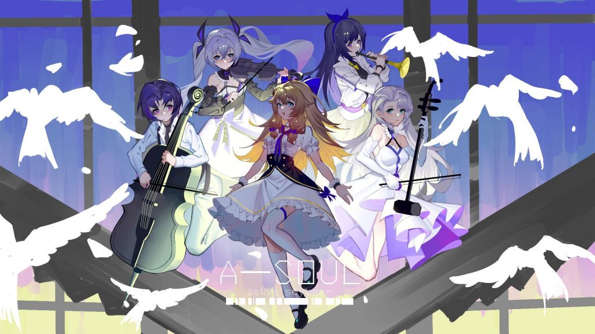
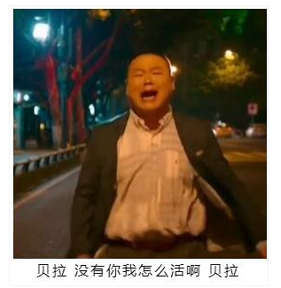

title: 她们真的..我哭死
author: Bing
date: 2021-06-09 20:43:29
tags:
---
她们真的，我哭死...

### 什么是Asoul？

乐华娱乐旗下虚拟偶像女团

### 前言

我记得是从去年疫情7月来上班之后，那段时间和两兄弟一起在江苏路租房，下班偶尔上网冲浪才第一次看V。其实本科时候就听说过啦（某人工智障AI绊爱）。

去年那时候看的还是holo切片，并没有看直播，然后holo倒了之后好像听说其他V洽鲸落，某红还冲到了8000舰，我都懵了，这玩意这么赚钱的吗？？？？

真正开始看点直播还是今年3月后的事了，现在会让我守着直播的只有asoul小剧场，确实看几个女孩子夸白比较有意思，说实话单人直播有时候会尬住，因为几个女生都不是专业搞直播这块的，想要话题不断说实话还是有点难度的，所以有的V红确实是有实力在那（但是养gachi的就算了），团体直播就算好很多，几个人一起你放几个男的上去也能聊（但是谁看呢!？）。

国V普遍混的几乎没日V好，比如某舞刚来直接千舰了？感觉这个纯粹是皮做的太好了，底边国V有实力的其实挺多的，但是阿B市场就那样了，有些日V哼哼唧唧那钱就疯狂打，对我这种铁公鸡真的是一脸问号，但是石油佬是真的多，也许人家眼里钱不是钱吧。

### Asoul

对于Asoul五个人，几乎各有各的特色，乐华真是捡到宝了。几乎拥有当前V圈最顶尖的技术力（背靠乐华和字节，论有个好爹的重要性），模型和动捕的精细度，这部分可以和喜欢搞3D的nijisanji对比一下，简直把天花板打烂了。

但是五个女孩子背后还是资本，而且还和企业势不同，企业势至少和企业签约后还有一定的活动权，大家一起分钱罢了，企业会给旗下的V提供平台和曝光机会。但是Asoul给人的感觉会像什么呢，五个打工人罢了，活动和时间表大家看起来都是运营决定的，但是运营估计都没怎么玩明白V圈，而且绝的是Asoul的粉丝，也就是俗称的“一个魂”们，都是老牛鬼蛇神了，这也是第一次男粉大规模加入“饭圈”（但是此饭圈非彼饭圈，只是可能是男粉第一次追偶像罢了）拿三次元偶像那套来搞虚拟偶像肯定是要翻车的。

五个小姐姐由于是新人，并不能像乐华前面大哥大姐们呼风唤雨，但是上镜的还是她们，运营出了篓子，到时候直播弹幕就会有多难看（估计晚晚又要蚌埠住了，晚晚我的晚晚😭😭😭），比如昨天运营搞出了BW握手卷，我tm直奔评论区看戏，果然全民出击。V圈由于不露脸，虽然皮能占一部分因素，嘶~也许是很大一部分因素，但是总的来说还是看人有没有趣，这波运营直接想搞三次元那一套属实是失了智了，估计公司内部都没啥人看V咯。

嘛，看这些娱乐直播也是图一乐而已，但是我好像还挺喜欢这几个小姐姐的，但从小到大喜欢的东西总是换了一茬又一茬，我还挺好奇这个虚拟偶像计划能走多远的。